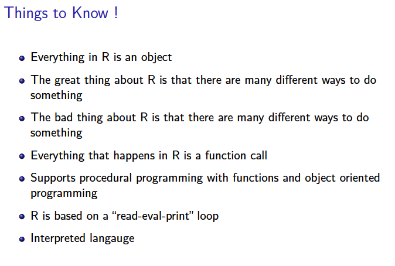
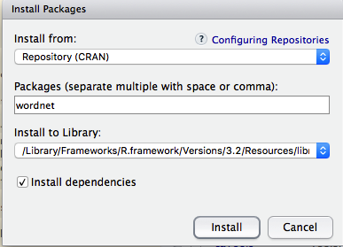

If you haven't already then download the following files from Github. 

## A Walk Through

Let's read some data from the Internet. This file comes from a larger tutorial at http://www.cyclismo.org/tutorial/R/cholesterol.html In this particular case we are looking at
engine emissions. Someone measured the output of some exhaust from engines in a factory to 
determine if the engines were performing well (or not). Let's read in the data and look at the 
first few records and then summarize it. We'll then make a boxplot of the three emissions. 

```{r}
url <- "http://steviep42.bitbucket.org/YOUTUBE.DIR/table_7_3.csv"

engine <- read.table(url, sep = ",", header=TRUE)

engine <- engine[,-1]  # We don't need the first column

head(engine)

summary(engine)

boxplot(engine, main="Boxplot of Emissions")

```

Okay we see that the Carbon Monoxide levels are mich different than the other two (hc and nox) so 
we might want to investigate that a little more. There are some basic things we can do to determine
of the "co" data is normally distributed. 

```{r}
# Plot some helpful graphs

par(mfrow=c(1,3))

boxplot(engine$co,main="Carbon Monoxide")

hist(engine$co)

qqnorm(engine$co,main="Carbon Monoxide")

qqline(engine$co)

shapiro.test(engine$co)

# Take the log of the CO
 
log.engine <- log(engine$co)
 
shapiro.test(log.engine)

```

So it doesn't appear that the co data is normally distributed although if we take the logarithm
of the data it turns out that that is normally distributed so we could work with that. Look at how
the plots look now

```{r}

par(mfrow=c(2,2))

log.engine = log(engine$co)

boxplot(log.engine,main="Carbon Monoxide")

hist(log.engine,main="Carbon Monoxide")

qqnorm(log.engine,main="QQ Plot for the Log of the Carbon Monoxide")

qqline(log.engine)

```

If we wanted to we could build a confidence interval of the mean of the co data. If we remember statistics we could do this by hand. 

```{r}
# Let's build a confidence interval

my.mean <- mean(log.engine)

my.sd <- sd(log.engine)

n <- length(log.engine)

# Get standard error

se <- my.sd/sqrt(n)

error <- se*qt(0.975,df=n-1)

left <- my.mean - error

right <- my.mean + error

c(left,right)

c(exp(left),exp(right))


```

So we could then do a hypothesis test to see of the mean is, for example, 5.4 

```{r}

# Test H0: mu  = 5.4 
#      HA:mu  != 5.4 

lNull <- log(5.4) - error

rNull <- log(5.4) + error

c(lNull,rNull)

my.mean


# So the mean is outside the range so we reject the null hypothesis. There is a low probability that 
# we would # have obtained our sample mean if the true mean really were 5.4.

# We could even have calculated the p-value by hand

p.val = 2*(1-pt((my.mean-log(5.4))/se,df=n-1))

p.val


```

But herein lies a valuable lesson. We don't need to do any of this by hand. Well we do need to read
in the data and plot it but in terms of creating confidence intervals, errors, p-values, and doing
our own hypothesis test - well we are working way too hard. There is a function that will do this for
us.

```{r}
# But its easier to call a procedure to do it all

t.test(log.engine,mu = log(5.4),alternative = "two.sided")


```

------

## History of R

<center></center>


## Who Uses R ? 

  Company     | How R is Used
| ----------- | ------------- |
Bank of America | Modeling and visualization 
Facebook | User analysis and interaction 
FDA | Used in parallel with SAS
Ford Motor Company | Decision support
Google | Calculate ROI on advertising
John Deere | Time series modeling and geospatial analysis
National Weather Service | Visualization for forecasting
New York Times Newspaper | Data visualization
Nordstrom | Recommendation systems
Orbitz Travel | Search result optimization
Twitter | User experience analysis
Trulia | Real Estate Housing cost predictions
OK Cupid | Online Dating Trend analysis
Lloyd's of London Insurance | Investment recommendation

* Companies as diverse as Google, Facebook Pfizer, Merck, Bank of America use R

* "R is really important to the point that it's hard to overvalue it", says
Daryl Pregibon a research scientist at Google. "It allows statisticians to do very intricate
and complicated analyses without knowing the blood and guts of the computing system".

* "R has really become the second language for people coming out of grad schoolnow, and
there's an amazing amount of code being written for it", said Max Kuhn, associate director
of nonclinical statistics at Pfizer.

* There are over 6,500 packages available on the Comprehensive R Archive Network (CRAN)

-----

## How Google Uses R 

* Google uses conditional regression models to evaluate the factors that lead to user satisfaction of Google products, such as when users are surveyed on satisfaction with search reports, or when users are asked to rate YouTube videos.

* Google wants to determine the effectiveness of display ads for its customers. When a brand-name company places a display (or banner) ad on a popular website like ESPN.com or CNN.com, it can be hard to judge its effectiveness, because a small percentage of visitors will click on a display ad. Using observational data from more than 10 million web users, Google compares the search behavior of people who were exposed to the display ad (i.e. those that never visited a web page displaying the ad) to similar users who did see the ad, to figure out how many additional people visit the advertiser's web site as a result of seeing the display ad.

* Source http://blog.revolutionanalytics.com/2011/08/google-r-effective-ads.html

----

## Motivations

* R is an interactive framework for data and statistical analysis that also happens 
to have a programming language embedded

* Compare this to languages such as Python, Perl, and Java that are first and foremost 
programming languages that offer statisitcal addons 

* Which language to use ? Exploit the strengths of all of them but if data analysis is 
a big part of the work then consider using R as part of the "pipeline"

* R can easily "wrap in" C, C++, and Java so if you have existing code in those languages
then you don't have to rewrite it. 

* Most of the effort in using R relates to shaping the data for analysis and understansing
the available function and packages - deep programming skills are **not** required but are
definitely rewarded. 

<center></center>

<center></center>

------

## Documentation 

### Free Books

Resource    | URL
----------- | ------------- 
The R Inferno | http://www.burns-stat.com/documents/books/the-r-inferno/
R Programming Wiki | http://en.wikibooks.org/wiki/R_Programming
Intro to Stats Using R | http://ipsur.org
Stats with R | http://zoonek2.free.fr/UNIX/48_R/all.html
Lattice Graphics | http://lmdvr.r-forge.r-project.org
Contributed R Info | http://cran.r-project.org/other-docs.html
simpleR Intro Stats | http://cran.r-project.org/doc/contrib/Verzani-SimpleR.pdf
DIY Intro to R | http://www.unt.edu/rss/class/Jon/R_SC/
R Bloggers | http://www.r-bloggers.com/
R Journal | http://journal.r-project.org/
R Tutorial | http://www.r-tutor.com/r-introduction
Google Style Guide | https://github.com/hadley/devtools/wiki/Style
Applied Epi Using R | http://www.medepi.net/docs/EpidemiologyUsingR.pdf


### For Cost Books

There are some good books you can buy although for this class they aren't
required.

Book        | Author
----------- | -------------
R Cookbook | Paul Teetor
R in a Nutshell | Joseph Adler
The Art of Programming | Norman Matlo
Data Manipulation with R | Phil Spector
ggplot2: Elegant Graphics for Data Analyses | Hadley Wickham
Intro to Scientic Programming and Simulation Using R | Jones, Maillardet, Robinson
Introductory Statistics with R | Peter Dalgaard
The R Book | Michael J. Crawley
Discovering Statistics Using R | Andy Field

### Mailing Lists

* Here are some mailing lists that accept questions relative to R and
BioConductor

* Moderators and participants in these lists take questions seriously - sometimes too seriously

* First search through the archives to see if your question has already been answered. Chances
are it has

Mailing Lists | URL
------------- | -------------
R-Help | http://stat.ethz.ch/mailman/listinfo/r-help
Cross Validated | http://stats.stackexchange.com
Stack Overflow | http://stackoverflow.com/questions/tagged

------

## Obtaining R

For this class you don't have to do anything since it is already installed for you although if you
wanted to install it on your laptop you could follow these directions:

<center></center>

------

## Tour of R GUIs

* R is provided with a command line interface (CLI), which is the preferred user interface for power users because it allows direct control on calculations and is flexible. However, good knowledge of the language is required. 

* Because of this, the CLI can be intimidating for beginners. Thankfully, there are a number of R GUIs out there to make your life easier: R Commander, R-Studio, JGR, SciViews-R, R.app (OSX), Tinn-R (Windows only), ECLIPSE with STATET, EMACs  

* Note that on Windows you get  default GUI that provides you with a reasonable amount of menu-drive capability. However, you could also use another GUI if you so desired.

* However I think the best GUI out there is [R-Studio](https://www.rstudio.com/) 
    + Access RStudio locally
    + Syntax highlighting, code completion, and smart indentation
    + Execute R code directly from the source editor
    + Quickly jump to function definitions
    + Easily manage multiple working directories using projects
    + Integrated R help and documentation
    + Interactive debugger to diagnose and fix errors quickly
    + Extensive package development tools

<center></center>

------


### Setting a Home folder location

First you can use the Tools -> Global Options -> R to set your default home folder for your R sessions. Don't worry there is nothing stopping you from moving around to other locations (if you need to) it's just that as far as RStudio is concerned whatever folder you specify in this option will be the one it uses whenever you start up. If you are at work you might make this a folder on a shared drive that is backed up. On a laptop you might make this a sub folder of a DropBox folder. Even if you aren't connected to the Internet always the changes you make will be synced once you reconnect. It's all really up to you of course but I suggest that you make it some place that can be routinely backed up. You might also consider that you should keep your code in a folder separate from your data unless your data is small. Program files, even files that are thousands of lines long, are quite manageable whereas data can grow in size over time.

### Making Customizations to your session

R will look in your Home folder (established above) called .RProfile to which it will refers whenever you begin your session. Note that it does NOT have to be present but if it is then R will scan through it looking for any requested changes to the R environemnt. This is something that you edit only occasionally (or not at all) to reflect desired customizations. At first you don't really mess with this file so much although it is important to know that it is there. I used it to preload packages that I know I will be using in my session. You can use your favorite editor to create and alter this file. Here is what mine looks like:


```{r eval=FALSE}
# Sample Rprofile.site file

# Things you might want to change
# options(papersize="a4")
# options(editor="notepad")
# options(pager="internal")

# R interactive prompt
# options(prompt="> ")
# options(continue="+ ")

# to prefer Compiled HTML
# help options(chmhelp=TRUE)
# to prefer HTML help
# options(htmlhelp=TRUE)

# General options
options(tab.width = 2)
options(width = 130)
options(graphics.record=TRUE)

# The following was added by Steve on 12/19/15 to load the ggplot2 and
# ddplyr packages. The way to do this is to create a function called .First
# that will get called once for each R session.

.First <- function() {
  library(ggplot2)
  library(dplyr)

  cat("\nSuccessfully loaded .Rprofile at", date(), "\n")
}
 
# Note that we have a function called .Last that will get invoked when the R session is
# terminated.

.Last <- function() {
  
  cat("\nDude I'm outta here ", date(), "\n")
}

```

## Variable names 

As in most programming languages, it is customary to store or hold the results of an operation in a variable name. 

* In R such results are assigned with the symbols <- or = 
* Variable names **are case senstive**
* Variables names cannot begin with the period character .
* Variable names cannot begin with numbers
* Variable names cannot contain spaces
* Variable names cannot begin with numbers or symbols (%,$, )


Valid       | Invalid
----------- | -------------
mean.height | .mean.height
smoker      | \_myvariable
non.smoker  | \_Mean.height
temp.var    | 1variable
patient\_id  | 1\_variable
Eye.Color | %some.var
State\_Population | "State Population"
White\_Cell\_Count | $White\_Cell\_count
jobTitle | .jobTitle

```{r eval=FALSE}
A <- 2.5     # The "<-" is the preferred method of assignment

# The following is equivalent to the above although it is using the "=" symbol
# This will work but is discouraged in variable assignments

A = 2.5      

A
[1] 2.5

mynewvar <- X + 3
MYNEWVAR <- X + 3 # Two different variables

# Note that when calling a function and supplying arguments it IS encouraged
# to use the = symbol. As a matter of fact if you try the <- operator in function argument
# names it will fail

set.seed(123)           # Set the random seed for reproducibility

normvals <- rnorm(20)   # Generate 20 values from a Normal distriution N(0,1)

mean(x=normvals,trim=0.5)  # Call the mean function and supply values for the arguments
[1] 0.1199852

# The following will never work so don't even try (well I am just to make a point)
mean(x <- normvals, trim <- 0.5)

```


------

## Some More Things to Know About R 

<center></center>

## Your First R Session

The best way to get accustomed to R is to use it as a calculator. This will familiarize you with the 
operators that R uses as well as the various functions R uses. There are many of these and since R is a
functional program language it should not suprise you that there are thousands of these functions. Your job
as a newcomer to R is basically to discover and find functions that do what it is you want to do. The idea
here is not to repeat yourself or write code especially when someon else has already done it for you. A 
smart programmer does not work harder than necessary. 

```{r}
?mean			     # Get help on the mean function

example(mean)	 # Run an example of kmeans (if it exists)

pi			     # Some popular quantities are built-in to R

sqrt(2)			 # Basic arithmetic

print(pi)		     # Print the comments of the pi variable


X <- 3; Y <- 4 	# Semicolon lets you enter 2 commands on the same line

Z <- sqrt(X^2 + Y^2)	# Variables contain information

ls()			     # List all variables in the “environment”

```

<center></center>

Here are some other example calculations. 

<center></center>

And here is a table that shows the operators necessary to do comparisons and programming statements. If
you have experience with another programming language then these should be familiar although each programming
language has it's own way of doing things. R uses the curly brace characters "{" and "}" to offset blocks 
of code that occur within a function definition or a loop. We will learn more about this later when we discuss
functions. 

<center></center>

## Getting Help within R

There are basically two modes when using R, interactive and batch. Typically we do a lot of up front development interactively and try out segments of code while building up a larger collection of code that we turn into an R function or even a package. You then have the option to run the code as part of other functions and code written by someone else. As you are developing stuff you will no doubt have questions about what arguments certain functions take. 

   + Use the "help" function built into RStudio which is ususally located in the right lower pane
   + Determine the function with which you need help (e.g. "mean") and at the console type "?mean"
   
```{r eval=FALSE}

?"mean"

mean                   package:base                    R Documentation

Arithmetic Mean

Description:

     Generic function for the (trimmed) arithmetic mean.

Usage:

     mean(x, ...)
     
     ## Default S3 method:
     mean(x, trim = 0, na.rm = FALSE, ...)
     
Arguments:

       x: An R object.  Currently there are methods for numeric/logical
          vectors and date, date-time and time interval objects.
          Complex vectors are allowed for ‘trim = 0’, only.

    trim: the fraction (0 to 0.5) of observations to be trimmed from
          each end of ‘x’ before the mean is computed.  Values of trim
          outside that range are taken as the nearest endpoint.

   na.rm: a logical value indicating whether ‘NA’ values should be
          stripped before the computation proceeds.

     ...: further arguments passed to or from other methods.


```

   
+ If you just know a general topic you want help on then use the double question mark or by using the **help.search()** function 

```{r eval=FALSE}
help.search("poisson regression")

# Same as below
     
??"poisson regression"
     
Help files with alias or concept or title matching ‘poisson regression’ using fuzzy matching:

mgcv::ziP                              GAM zero-inflated Poisson regression family
Type '?PKG::FOO' to inspect entries 'PKG::FOO', or 'TYPE?PKG::FOO' for entries like 'PKG::FOO-TYPE'.


```


------

## The R Environment

<center></center>

The R "Environment" is a actually a formal concept. When you start R you are in a specific folder or directory. Within that folder R is observes what variables, dataframes, lists, modeling objects, etc you create and remove. Unless you take specific action to eliminate any of these they will remain in the "environment" for future refernece. It's somewhat like having lots of different papers on your desks some of which might be related or not. The strength of this approach is that you have everything in your environment so you can see what is there. 

There is also a history mechanism that "remembers"" everything you type. In RStudio both of these are easy to access. They are usually accessible in the upper right pane of the RStudio interface via the "Environment" and "History" tabs. If you were to look in the folder where you are currently working you might see two files called ".RData" and ".Rhistory" which is where R dumps the aforementioned information. The RStudio IDE has a graphical interface offers a way that let's you move around the filesystem (if you want) but if you are thinking about writing programs to do something then it's best for you to understand how to set a working directory via functions calls It isn't at all hard.

```{r}
getwd()     # Will tell you what folder your current R environment is in

# Allows you to set a working directory - on linux and OSX this will set the working 
# directory / folder to be your "home" directory.

setwd("~")     

# You can use absolute or relative path references also. I'm using Apple OSX usually so
# the path names are prefixed with the forward slash character

# setwd("/Users/fender/Downloads")

# Windows paths look something like the following. Note that the path must exist 

# setwd("C:\Home\wsp")  
```

If you wanted to list what variables exist in your current environment you can use the **ls()** function to help out. This is the equivalent of looking in the upper right RStudio pane and clicking on the Environment pane. 


```{r}

# Where am I ?

getwd()     # Shows you your current folder/directory

ls()        # Shows you any and all variables that have been created

# Let's create some variables here

a <- 3
b <- 5
c <- 5

# Now the ls will show these. They will stay in your environment even if you decide to stop
# R. As long as you restart R in the same folder then these variables will "come back" because
# R will read the .RData file in that folder.

ls()

# To remove these variables issue the following command. They are now gone forever. 
# You could always check the History to see what commands you used to create them should
# you not remember. In this case it is trivial to reproduce.

rm(a,b,c)

# or

rm()

```

------

### Saving a copy of your environment with RStudio

When you quit RStudio you are prompted with a question as to whether you
wish to "save" your current environment. The default is "yes" since it is likely that you have accumulated lots of stuff in your environment so you probably don't want to lose it. The benefit is that the next time you start RSdtudio up in that folder it will "reload" all the variables and data strucutres you created earlier. This is nice. The upper right pane has an **Environment** tab wherein you can save off a copy of your current environment or load in one that had been saved previously. By default this pane will show you all currently defined objects in your existing environment. 

<center></center>

### Listing files in the working folder

There are also two ways for you to list the actual files contained in your working folder. For example at the console prompt you could do something like the following and whatever files you currently have in your folder will be listed. You could also see what files you have by consulting the lower right pane and clicking the **Files** tab and it will show you.

```{r}
list.files()
```

The advantage of using the **list.files()** function is that it will create a vector that you could process programmatically. For example consider the following. 

```{r}
list.files("../data")

```

------

## Base Packages

R comes pre-installed with a set of Base "packages". The idea of "packages" is important in R as it is 
the primary way that users create code for sharing. You can do this also which is great. Once you have
developed some cool functions and code to do some interesting things you can create a package according
to the published standard(s) and then share your package with others who can then "install" your package. 
Technically, you don't **have** to create a package to share your code. It's easy to send code fragments
back and forth via email or Github. It's just that if you write a publication or want others to have
self-document code with examples then the package approach is the best way to go. Meanwhile, just know
that R has a number of packages built into the default installation.

```{r}
getOption("defaultPackages")

search()

library(help="stats")

```

An easier way to do this is to simply use the "Packages" tab in the lower right pane of the RSudio window. 

<center></center>

## CRAN Packages

One of the most powerful aspects of R is the ability to install user-contributed addon packages available in CRAN, (Comprehensive R Archive Network). As of December 2014 there are over 6,500 packages available.

To obtain information on the wide variety of packages then vist the following URL to see some of the areas covered. cran.cnr.berkeley.edu Also go to the\Task Views' You can also see packages grouped by domain at http://cran.r-project.org/web/views/

Here is a screenshot of just some of the research domains and areas of interest wherein people have written packages. The way to use this is that if you are working on a new project and find yourself wanting to do something then first check CRAN to see if someone else has already written
something. I cannot emphasize this enough. This is a great thing about R. 

<center></center>

## Installing Packages

If you are using RStudio there are menu items that can simplify the process of identifying and installing packages. Just go to the "Tools" -> "Install Packages" tab and you will be promoted to enter a package name. However, you can also do this from the command prompt. Let's say you want to install the \actuar" package from CRAN. 

```{r eval=FALSE}
install.packages("tau",dependencies=TRUE)
trying URL 'https://mirrors.nics.utk.edu/cran/bin/macosx/mavericks/contrib/3.2/tau_0.0-18.tgz'
Content type 'application/x-gzip' length 167799 bytes (163 KB)
==================================================
downloaded 163 KB


The downloaded binary packages are in
	/var/folders/k8/vvn0w6vd6kv3ykr21dwy73q00000gn/T//RtmpzgExzd/downloaded_packages
 
# note that the library function will "load" the package "tau" onto the search path
# for R which in turn will make all the functions in "tau" available for use. You will
# have to do this for each invocation of R unless you edit your .RProfile file to automatically
# load "tau" everytime you start R. 

library(tau)

library(help="tau")  # This will show you help for all the functions in "tau"
 
search()
 [1] ".GlobalEnv"        "package:tau"       "package:stats"     "package:graphics"  "package:grDevices" "package:utils"    
 [7] "package:datasets"  "package:methods"   "Autoloads"         "package:base"     

```

If you went the route of using RStudio to do this then you would do **Tools -> Install Package** and you would then see a dialogue like this:

<center></center>

------

## Getting Data Into R

Getting Data into R is the first serious challenge that any newcomer to R will face. Usually you start by getting code snippets from other users and/or the Internet or perhaps out of one of the many R books available. There are no "rules" for importing data but there are common functions that are frequently used some of which I present here. You should be able to get a lot of mileage out these examples.

R has a number of ways to read in information of different formats. There are a number of packages such as data.table that can import really large files. There are also packages for interacting with Relational Database Management systems that allow you to use SQL. There is also support for noSQL databases such as MongoDB. In reality there are packages to handle lots of different data types such as GIS information and HD5 format so if you have what you believe to be a standard format then check CRAN to see if someone has already written something to parse data.  Here is a summary of some of the functions and packages available for importing data:

File Type     | Functions      | Associated R Packages
------------- | ------------- | -------------
Text files    | read.table, read.csv, read_csv | Base, readr
.CSV   | read.csv, read_csv, fread | Base, readr, data.table
Excel | read_excel, readWorksheetFromFile, read.xlsx | readxl, XLConnect, xlsx
SAS, SPSS, Stata | read_sas, read_spss, read.spss | foreign, Haven 
JSON | fromJSON | rjson
XML | xmlTreeParse, xmlRoot | XML
SQL | (See package doc) | RMySQL, RODC, RSQLite, ROracle, rmongodb
HTML Tables | html, html_nodes, htmlParse  | rvest, XML

Before proceeding it is important to note that RStudio has some ways to get in data for you via it's interface. While this is convenient it doesn't really help you if and when you need to write programs for use by others who might not know or care about where the data came from. So you could go to "Tools -> Import Dataset" and it would prompt your for a URL of a file to downlaod and import. Nice but for the general case it's best to learn how to do this as part of a program.


### Import files with comma separated values (.CSV)

These files are simple text files that have fields separated by a delimiter which is most often a comma although it could be a vertical bar character, a tab character, or even a space. Usually these types of files were once an Excel worksheet that someone decided to export into a .CSV file. These files can also come from other programs like SAS and SPSS. They are also commonly found on the Internet and easily be downloaded and/or many times read directly from the Internet site where it is hosted. 

The advantage of this format is that it is generic and can easily be read by any analytics program anywhere. R provides a functions called **read.csv()** whose whole purpose in life is to import these types of files. There is also a function caleld **read.table()** which is the same function (under a different name) though most people beging with **read.csv()** since it has some "sane" defaults for reading in .CSV files. Before downloading files it is best to first understand how to determine and change your "working directory". 

```{r}
# On Windows systems you might need to use the "more" command or
# install PowerShell which provides UNIX like capabilities

system("head ../data/airports.csv")

# From the above we see that there is a "header" line that tells us what the 
# columns should be named. This is useful but not necessary

# Let's specify the location and filename in a variable

filename <- "../data/airports.csv"

airports <- read.csv(filename)

head(airports)

str(airports)

# The following is equivalent to the above call to read.csv

airports <- read.csv(filename, header=TRUE, sep=",")
```

Ususally this is about as complicated as it gets although there are people who like to use tab characters "\t" as a delimeter. This might be useful for example if any of the fields contain text that has comma characters contained therein. In this case the delimiter is not a comma so there would be no confusion when reading in the file. We'll experiment with some examples in a bit. The analog to **read.csv()** is called **write.csv()** which takes an R data frame and creates a .CSV file. Here we will write out the airports data frame into an external file without the header. 

```{r}
write.table(airports,file="airports_noheader.csv",col.names=FALSE,sep=",")

system("head airports_noheader.csv")
```

The above makes some sense although for some strange reason it wrote out the file with row numbers which you may or may not want. It's not a big deal as the *read.csv()* function has an argument called *row.names* that if set to TRUE will understand that the .CSV file does in fact contain row names. You could always eliminate them once you have read in the data frame. If we wanted to prevent row names from being written here is how this would look:

```{r}
write.table(airports,file="airports_noheader.csv",row.names=FALSE, col.names=FALSE,sep=",")

system("head -3 airports_noheader.csv") # List only the first 3 lines
```

Let's select a different delimiter just to prove that this can be done.

```{r}
write.table(airports,file="airports_noheader.csv",row.names=FALSE, 
                     col.names=FALSE, sep="\t")

system("head -3 airports_noheader.csv") # List only the first 3 lines
```

### Handling commas and within fields/columns in numeric values

Now how would we handle the following .CSV file ? It looks innocent enough but look what happens when we accept the defaults offered by **read.csv()**

```{r}
system("head -3 ../data/employees.csv")

# The following will generate errors because read.csv wants to treat the commas in the
# employee names as field/column separators and that isn't what we want.

# employees <- read.csv("/Users/fender/bootcamp/data/employees.csv")


# To fix this we will need to specify the correct delimiter

employees <- read.csv("../data/employees.csv",sep="\t")
head(employees)
str(employees)
```

But the above still isn't correct as when read.csv processes the data it saw a comma in the salary column and assumed that that column is character. We want it to be numeric so we can do computations on it. The best way to handle this in my opinion is to go ahead and let R read in the data after which we will correct the problem using some other functions.

```{r}
employees <- read.csv("/Users/fender/bootcamp/data/employees.csv",sep="\t")

employees$salary <- as.numeric(gsub(",","",employees$salary))

str(employees)

```

The above works because the **gsub()** function is "vectorized" and will work on an entire column of data at a time. It's job is to look for a given character (in this case a comma) ad replace it with another character which we chose to be an empty space - but this is still a character so we have to then pass this result to the **as.numeric()** function to "coerce" it into a number. Here is the process step by step:
```{r}
employees <- read.csv("/Users/fender/bootcamp/data/employees.csv",sep="\t")

num_string <- employees$salary
str(num_string)

new_num_string <- gsub(",","",num_string)
str(new_num_string)

final_num_string <- as.numeric(new_num_string)
str(final_num_string)

# So all at once 

as.numeric(gsub(",","",employees$salary))
```


### Reading .CSV files directly from the Internet

This is actually a great way to get information straight from the Internet without first having to download it. However, it is easy to download the information and then read it and you might want to do this just to be courteous to the hoster of the data since you don't want to write code that forever "hits" a server that one day might go away. But for exploratory stuff this is really cool. Here are some examples that will work with what we already know about the **read.csv()** command. The above files are also maintained on my Github Account so if you know their URL then you could read them directly from that

```{r}

# Get the URL for the file 

url <- "https://raw.githubusercontent.com/steviep42/bootcamp/master/data/airports.csv"

# Then use read.csv to get it just like before except this is coming straight from the Internet

airports <- read.csv(url)

str(airports)

# We could have done something like the following if we though we would frequently be 
# reading the data. For large files it is best to download them first.

download.file(url,"airports.csv")
airports <- read.csv("airports.csv")

```

### Reading Tabular Data from the Internet

A common thing is to want to read information residing in tables on the Internet such as those found on Wikipedia although it could be any type of tabular information in general. Let's look at [this web page that](https://en.wikipedia.org/wiki/World_population) that has information on World populations. I'm interested in getting information on the "10 most populous countries" which is listed in an HTML table midway down the page. There appear to be other tables before this one so I'll need to experiment to determine what number table it is. 
There is an R package called **rvest** that can help us. This is the table we want to parse out from the page:

<center></center>

```{r}
library(rvest)

url <- "https://en.wikipedia.org/wiki/World_population"

# The following will "parse" the underlying HTML for the page

my_html <- read_html(url)

# Next we want to get the "nodes" from the parsed HTML that correspond to tables
# There are in fact many tables on this page but we are trying to target the one
# that has the ten most populous countries - table number 3 perhaps ? 

my_tables <- html_nodes(my_html,"table")[[6]]

html_table(my_tables)

( populous_table <- html_table(my_tables) )

# Okay this looks close but there is more work to be done to clean it all up 
# We don't need columns 4 through 6 

populous_table <- populous_table[,-4:-6]

populous_table$Population <- as.numeric(gsub(",","",populous_table$Population))/100000

names(populous_table) = c("Rank","Country","Population")

library(lattice)
xyplot(Population ~ as.factor(Country), populous_table,
       scales = list(x = c(rot=60)),
       type="h",main="Most Densely Populated Countries")

```

-----

### Reading XML from the Internet

R can also process XML files from the Internet, which is very powerful.
As an example we’ll access Google’s GeoCoding pages to get the Latitude
and Longitude for Atlanta, GA from within a program. It's just a simple
example. See 

```{r}
library(RCurl)
library(XML)
my.url <- "http://maps.googleapis.com/maps/api/geocode/xml?address=Atlanta,GA&sensor=false"

txt <- getURL(my.url)
hold <- xmlTreeParse(txt,useInternalNodes=TRUE)

hold

place <- getNodeSet(hold,"//GeocodeResponse/result[1]/geometry/location[1]/*")

as.numeric(sapply(place,xmlValue))
```


### Reading Excel Files

This is a popular request although I think it's probably better to read from .CSV files where possible. In the past there have been a number of packages dedicated to reading Excel with varying degress of success. Some will read only individual worksheets whereas others can access multiple worksheets within a workbook which is pretty nice. There is a package 


```{r}

# Note that one must install the devtools package
# install("devtools")
# 
require(devtools)


```

